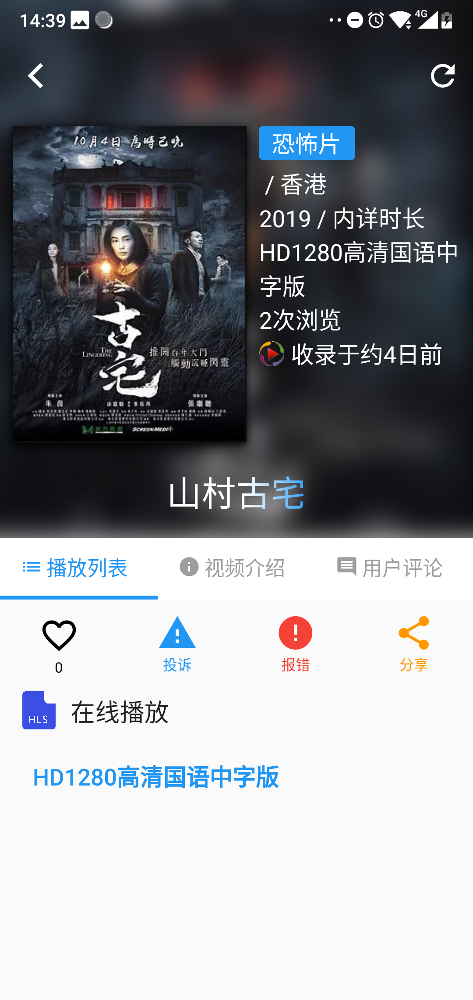
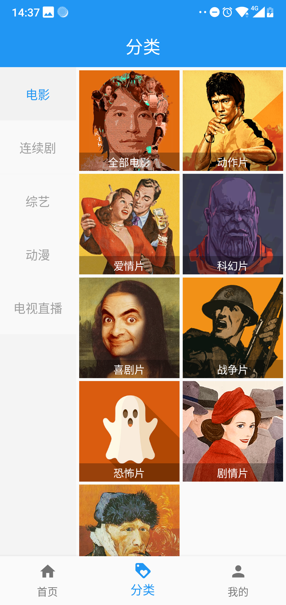
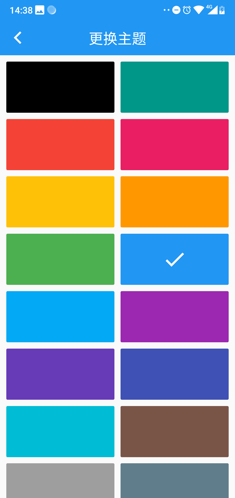
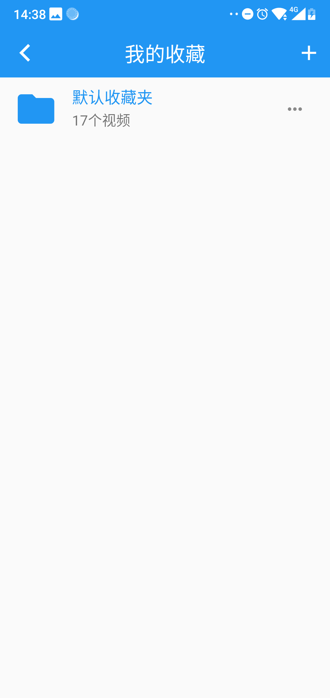
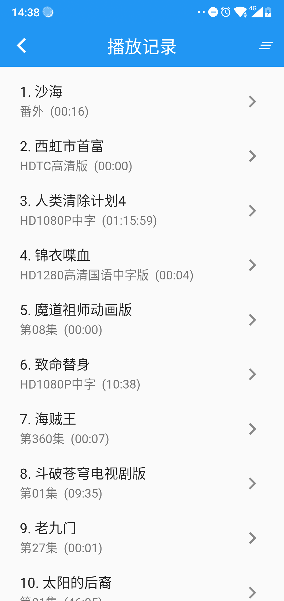
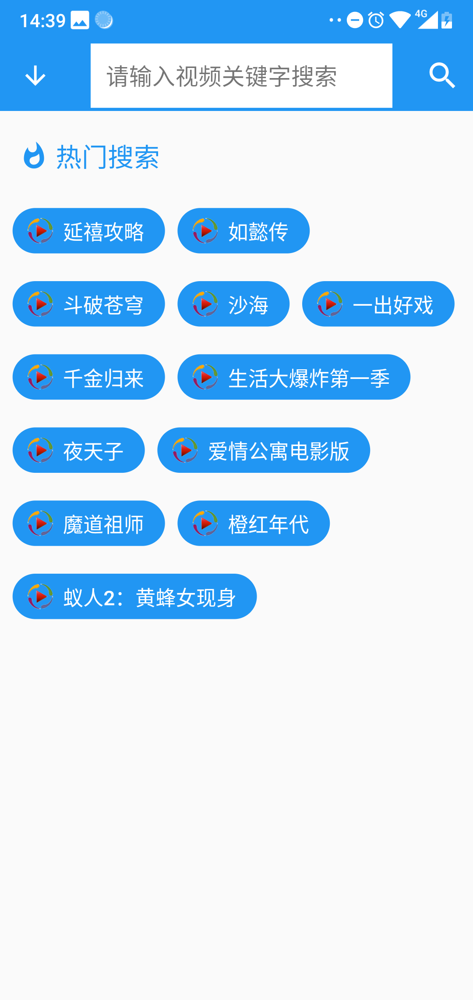

# 黑人视频app

> [黑人视频]是一款基于flutter实现的在线视频播放app

# 下载

> [https://dd.shmy.tech/download](https://dd.shmy.tech/download)

# 截图

# 本地依赖  

* video_player: [https://github.com/shmy/flutter_video_player](https://github.com/shmy/flutter_video_player)
* toasty: [https://github.com/shmy/flutter_toasty](https://github.com/shmy/flutter_toasty)
* clipboard: [https://github.com/shmy/flutter_clipboard](https://github.com/shmy/flutter_clipboard)
* loading: [https://github.com/shmy/flutter_loading](https://github.com/shmy/flutter_loading)
* webview: [https://github.com/shmy/flutter_webview](https://github.com/shmy/flutter_webview)
* android_intent: [https://github.com/shmy/android_intent](https://github.com/shmy/android_intent)
* tx_xg: [https://github.com/shmy/flutter_tx_xg](https://github.com/shmy/flutter_tx_xg)